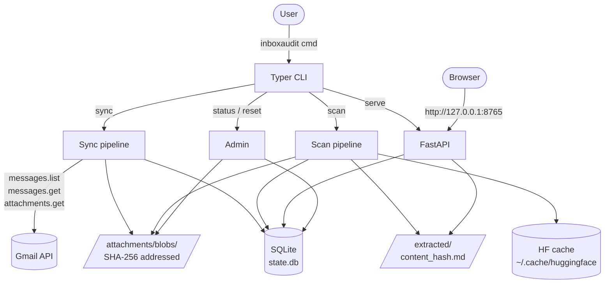
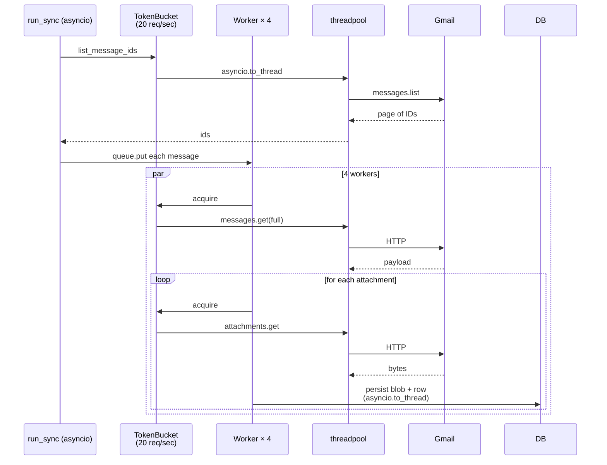

# Architecture

A local-first, read-only Gmail PII scanner. All processing happens on
the user's machine; the only outbound network is to Google's Gmail API
during the sync phase and (on first run) HuggingFace Hub to download
model weights.

## System overview



Everything below the CLI runs in one process; there's no daemon, no
background service, no IPC. Each command is its own short-lived
invocation that touches the SQLite DB and the data-dir files.

## Two-phase design

The most important architectural decision is splitting **sync**
(network-bound) from **scan** (offline). See
[ADR 0001](decisions/0001-two-phase-architecture.md) for the *why*; the
short version:

| Phase | Network | Mutable state | Cost model |
|---|---|---|---|
| Sync (`inboxaudit sync`) | Gmail API (read-only) | DB rows + blob files | One-time per inbox; bandwidth-bound |
| Scan (`inboxaudit scan`) | None (HF cache on first run only) | DB rows + extracted markdown | Re-runnable; CPU-bound |

The two phases share the SQLite DB but otherwise run independently. You
can interrupt sync mid-flight and re-run; you can re-scan as many times
as you like with different detector thresholds and never touch Gmail
again.

## Component map

```
inboxaudit/
├── cli.py                         # Typer commands (auth, sync, scan, serve, status, reset)
├── server.py                      # FastAPI app + Pydantic response models
├── config.py                      # pydantic-settings Settings + load_settings()
├── db.py                          # SQLAlchemy engine + session_scope context manager
├── models.py                      # SQLAlchemy ORM models
├── migrations.py                  # Programmatic Alembic runner; called from _bootstrap
├── blobs.py                       # Content-addressed blob storage helpers
├── logging.py                     # structlog setup
│
├── gmail/                         # Phase 1 ONLY — never imported outside sync path
│   ├── auth.py                    # OAuth flow + token refresh
│   ├── client.py                  # Gmail API wrapper (sync, wrapped in to_thread)
│   ├── rate_limiter.py            # TokenBucket (20 req/sec)
│   └── sync.py                    # run_sync(): 4-worker async orchestration
│
├── extraction/                    # Phase 2 stage A
│   ├── router.py                  # mime → "docling" | "unparseable"
│   └── docling_extractor.py       # Singleton DocumentConverter, returns markdown
│
├── detection/                     # Phase 2 stage B
│   ├── types.py                   # Finding / Detection dataclasses, Profile enum, RISK_WEIGHTS
│   ├── presidio_detector.py       # Pattern PII (CREDIT_CARD, US_SSN, etc.)
│   ├── privacy_filter_detector.py # Contextual PII via openai/privacy-filter
│   ├── categorizer.py             # _REGISTRY: (detector, subtype) → (category, tier); verdict math
│   └── runner.py                  # Orchestrates both detectors per attachment
│
├── pipelines/
│   ├── sync_pipeline.py           # Re-exports gmail.sync.run_sync (entry point)
│   └── scan_pipeline.py           # run_scan(): stage A + stage B + verdict aggregation
│
└── frontend/
    └── index.html                 # Single-file Alpine + Tailwind UI (CDN deps)

alembic/                           # Migrations
├── env.py                         # Reads DB path from load_settings()
└── versions/
    ├── 515b1b73d67d_initial_schema.py
    └── 1c965f28e09a_stable_attachment_composite_via_partid.py
```

Module boundaries to respect:

- `gmail/` is **only** touched during sync. Don't import it from
  `extraction/`, `detection/`, or `server.py`.
- `extraction/router.py` is the only place that decides which extractor
  handles which mime type. New formats: add a row there.
- `detection/categorizer.py` is the single source of truth for
  `(detector, subtype) → user_category`. New detector subtype: add a
  row there; a coverage test fails if the chosen category isn't in
  `RISK_WEIGHTS`.

## Concurrency model



Key facts:

- Single event loop. Python's GIL is fine here because the Gmail client
  (`googleapiclient`) is sync and released for I/O; we wrap it in
  `asyncio.to_thread` to bridge into the async layer.
- The token bucket is shared across all workers — caps the **combined**
  rate, not per-worker.
- DB writes happen inside `asyncio.to_thread` too. SQLite WAL mode
  (enabled in `db.py`) handles 4-worker concurrent writes.
- Scan-phase concurrency is more modest: a small `asyncio.Semaphore`
  bounds Docling extractions (default 2) and detection runs
  sequentially per attachment (default 1) since the heavy detectors
  share singletons internally.

## Tech stack

| Layer | Choice | Rationale |
|---|---|---|
| Language | Python 3.11+ | `from __future__ import annotations` + `X \| None` syntax |
| CLI | [Typer](https://typer.tiangolo.com/) | Type-hinted, lightweight |
| Web framework | [FastAPI](https://fastapi.tiangolo.com/) + [Uvicorn](https://www.uvicorn.org/) | Pydantic response models, auto-OpenAPI for free |
| DB | SQLite via [SQLAlchemy 2.0](https://docs.sqlalchemy.org/en/20/) | Single file, no service; WAL handles modest concurrency |
| Migrations | [Alembic](https://alembic.sqlalchemy.org/) | Auto-runs on every CLI invocation |
| Frontend | Alpine.js + Tailwind via CDN | Zero build step, single HTML file |
| Gmail | `google-api-python-client` + `google-auth-oauthlib` | OAuth + retry handling out of the box |
| Document extraction | [Docling 2.x](https://github.com/docling-project/docling) | Single backend covers PDF/Office/image + OCR |
| Pattern PII | [Microsoft Presidio](https://microsoft.github.io/presidio/) | Validates checksums for cards / SSN / IBAN |
| Contextual PII | [`openai/privacy-filter`](https://huggingface.co/openai/privacy-filter) via Transformers | Token classifier; catches addresses, names, accounts |
| Settings | [pydantic-settings](https://docs.pydantic.dev/latest/concepts/pydantic_settings/) | YAML + env var overrides |
| Logging | [structlog](https://www.structlog.org/) | JSON to file, pretty to console |
| Packaging | [uv](https://github.com/astral-sh/uv) + hatchling | Fast resolver, lockfile |

## Where deltas from the plan live

[`archives/IMPLEMENTATION_PLAN.md`](archives/IMPLEMENTATION_PLAN.md)
is preserved as the original spec. The build diverged in three places of note; each has its
own ADR:

| Plan said | Built as | ADR |
|---|---|---|
| Two extractor backends (Docling + Qwen-VL via `llama-server`) | Docling-only; `do_picture_description=True` is the in-process fallback if quality slips | [0003](decisions/0003-single-extraction-backend.md) |
| Attachments PK = `(message_id, gmail_attachment_id)` | PK = `(message_id, part_id)`; `gmail_attachment_id` is a refreshable column | [0004](decisions/0004-attachment-key-uses-part-id.md) |
| `~/.inboxaudit/` is the data dir | Source checkout dev runs land in `<repo>/.inboxaudit-data/`; wheel installs still use `~/.inboxaudit/` | n/a — convention captured in [`../CLAUDE.md`](../CLAUDE.md) |

The plan's v2 backlog (Outlook, daemon mode, encrypted storage, etc.)
is the canonical wishlist; nothing has been moved out of it.

## See also

- [Data model](data-model.md) — SQLite schema in detail.
- [Sync pipeline](sync-pipeline.md) — phase 1 deep dive.
- [Scan pipeline](scan-pipeline.md) — phase 2 deep dive.
