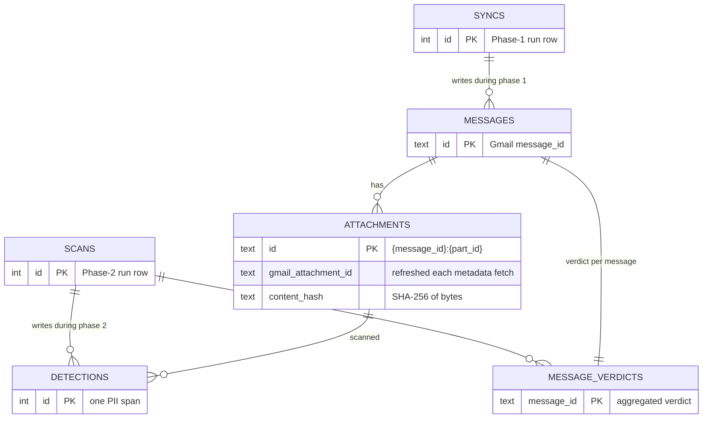

# Data model

SQLite at `<data_dir>/state.db`. Schema defined in
[`inboxaudit/models.py`](../inboxaudit/models.py), migrated by
Alembic. WAL mode and `foreign_keys=ON` are enforced in
[`db.py`](../inboxaudit/db.py) on every connection.

## Entity overview



Two run-log tables (`syncs`, `scans`) and four data tables. The split
mirrors the [two-phase
architecture](decisions/0001-two-phase-architecture.md): sync writes
`messages` and `attachments` with `sync_status` columns; scan writes
`detections` and `message_verdicts` (and updates `extraction_*`
columns on `attachments`).

## Tables

### `syncs` — phase 1 run log

One row per `inboxaudit sync` invocation.

| Column | Type | Notes |
|---|---|---|
| `id` | INT PK | auto |
| `started_at`, `finished_at` | DATETIME | naïve UTC |
| `status` | TEXT | `running` / `completed` / `failed` |
| `total_messages` | INT | Listed by `messages.list` |
| `synced_messages` | INT | Successfully processed this run |
| `error` | TEXT | top-level failure message |
| `mailbox_scope` | TEXT | `all` (default), `inbox`, or `sent` — which `--mailbox` flag the operator used. Nullable so pre-migration rows remain valid; the `status` command renders them as "all (legacy row)" |

The `Message.sync_id` FK points to the sync that most recently
processed each message. On a resumed sync, that's the new sync's id.

### `scans` — phase 2 run log

One row per `inboxaudit scan` invocation.

| Column | Type | Notes |
|---|---|---|
| `id` | INT PK | auto |
| `started_at`, `finished_at` | DATETIME | naïve UTC |
| `status` | TEXT | `running` / `completed` / `failed` |
| `total_attachments` | INT | Work set size (max of extract and detect counts) |
| `processed_attachments` | INT | Attachments actually touched this scan |
| `config_snapshot` | JSON | Threshold + concurrency knobs for reproducibility |
| `error` | TEXT | top-level failure |

### `messages` — one row per Gmail message we've seen

PK is the **Gmail message ID** — stable, never recycled, what Gmail
itself uses in mailbox URLs.

| Column | Type | Lifecycle |
|---|---|---|
| `id` | TEXT PK | Set on first list; never changes |
| `thread_id` | TEXT | Informational; thread IDs *can* shift |
| `sync_id` | INT FK → syncs | Last sync that touched this row |
| `sender` | TEXT | Raw `From:` header |
| `subject` | TEXT | Raw `Subject:` header |
| `received_at` | DATETIME | RFC 2822 `Date:` → naïve UTC |
| `has_attachments`, `attachment_count` | BOOL / INT | Filled when metadata is fetched |
| `sync_status` | TEXT | `pending` → `synced`; or `sync_error` on failure |
| `sync_error` | TEXT | last error message |
| `synced_at` | DATETIME | timestamp of the most recent successful sync |

`sync_status` transitions:

```
                ┌─ messages.list returns the id
                ▼
            ┌───────┐  metadata + attachments fetched
            │pending│ ─────────────────────────────────►  ┌──────┐
            └───┬───┘                                     │synced│
                │  any exception during processing        └──────┘
                ▼                                            ▲
            ┌──────────┐  next sync run retries it           │
            │sync_error│ ───────────────────────────────────►┘
            └──────────┘
```

Index: `idx_messages_sync_status` — the resumability query
`WHERE sync_status IN ('pending', 'sync_error')` hits it.

### `attachments` — one row per attachment part

**Composite primary key** of `{message_id}:{part_id}`. Gmail's
`part_id` is documented as immutable for the lifetime of the message,
so this key is stable across re-syncs. The volatile
`gmail_attachment_id` (which expires after a few hours) lives in its
own column and is refreshed on every metadata fetch — see
[ADR 0004](decisions/0004-attachment-key-uses-part-id.md) for why.

| Column | Type | Lifecycle |
|---|---|---|
| `id` | TEXT PK | Composite `{message_id}:{part_id}` |
| `message_id` | TEXT FK → messages | parent |
| `part_id` | TEXT | Gmail's stable part identifier (e.g. `"1"`, `"0.2"`) |
| `gmail_attachment_id` | TEXT | **Volatile** — refreshed on each metadata fetch |
| `filename` | TEXT | original filename |
| `mime_type` | TEXT | as reported by Gmail |
| `size_bytes` | INT | as reported by Gmail |
| `content_hash` | TEXT | SHA-256 of bytes, filled after download |
| `blob_path` | TEXT | relative path under `attachments/` |
| `sync_status` | TEXT | `pending` / `downloaded` / `skipped_filter` / `skipped_too_large` / `sync_error` |
| `sync_error` | TEXT | last error message |
| `downloaded_at` | DATETIME | |
| `last_scan_id` | INT FK → scans | most recent scan that touched this row |
| `extraction_route` | TEXT | `docling` / `unparseable` (`qwen-vl` is dead, see ADR 0003) |
| `extraction_status` | TEXT | `pending` / `extracted` / `unparseable` |
| `extracted_text_path` | TEXT | relative path under `extracted/` (filename is `<content_hash>.md`) |
| `extracted_at` | DATETIME | |
| `extraction_error` | TEXT | error if extraction failed |

`sync_status` transitions:

```
              ┌─ row inserted during metadata walk
              ▼
        ┌──────────────────────┐
        │ pending              │     mime/size filters during walk
        │ skipped_filter       │  ◄─ (mime in skip list, size < 1KB, > max_attachment_bytes)
        │ skipped_too_large    │
        └──────┬───────────────┘
               │ pending only proceeds to download
               ▼
        ┌──────────┐                    ┌──────────┐
        │downloaded│       failure ────►│sync_error│  next sync retries
        └──────────┘                    └──────────┘
```

`extraction_status` transitions (independent of sync_status):

```
            null  ──►  pending  ──►  extracted  ──┐
                                                  │
                                  unparseable  ◄──┤   if Docling fails or route returns "unparseable"
                                                  │
                                  (re-runs on scan with --force-extract)
```

Indexes:

- `idx_attachments_message` — joining to messages.
- `idx_attachments_extraction` — selecting work for the detect stage
  (`extraction_status = 'extracted'`).
- `idx_attachments_hash` — dedup lookups when storing blobs.

### `detections` — one PII span per row

Scan-scoped: re-running scan **deletes prior detections** for each
affected attachment and writes the new ones. Tracked through
`scan_id`.

| Column | Type | Notes |
|---|---|---|
| `id` | INT PK | auto |
| `scan_id` | INT FK → scans | which scan produced it |
| `attachment_id` | TEXT FK → attachments | which attachment it was found on |
| `category` | TEXT | `gov_id` / `financial` / `tax` / `medical` / `credentials` / `legal` / `other_pii` |
| `subtype` | TEXT | detector-native label (`US_SSN`, `private_address`, …) |
| `detector` | TEXT | `presidio` / `privacy_filter` |
| `span_text` | TEXT | the matched text (capped at 500 chars) |
| `span_start`, `span_end` | INT | character offsets into the extracted markdown |
| `confidence` | REAL | 0..1 (length-weighted for merged Privacy Filter spans) |
| `created_at` | DATETIME | |

Indexes:

- `idx_detections_scan` — purging prior-scan detections.
- `idx_detections_attachment` — the API reads detections per
  attachment.

### `message_verdicts` — aggregated per-message verdict

Computed at the end of each scan from `detections`. One row per
message. **Upserted** every scan (delete-then-insert under a single
transaction).

| Column | Type | Notes |
|---|---|---|
| `message_id` | TEXT PK FK → messages | one verdict per message |
| `scan_id` | INT FK → scans | which scan produced it |
| `is_flagged` | BOOL | true iff ≥ 1 finding in a flaggable category |
| `top_category` | TEXT | highest-weight present (ties broken by count, then alphabetical) |
| `risk_score` | REAL | sum of `RISK_WEIGHTS[category] × count`, capped at 100 |
| `category_summary` | JSON | `{category: count}` for the UI's badges |

Index: `idx_verdicts_flagged(is_flagged, risk_score DESC)` — the
`/api/flagged` list scans this in flagged-then-risk order.

The categorizer's full mapping lives in
[`detection/categorizer.py`](../inboxaudit/detection/categorizer.py).
See [Scan pipeline § detection](scan-pipeline.md#detection-stage) for
the per-category weights and flagging rules.

## Re-scan semantics

Running `inboxaudit scan` twice in a row produces **bit-for-bit
identical** `detections` and `message_verdicts` content (modulo the
new `scan_id` and timestamps). The path:

1. Insert a new `scans` row with `status='running'`.
2. **Stage A — extract:** for each attachment with
   `sync_status='downloaded'`, if `extraction_status != 'extracted'`
   (or `--force-extract`), re-extract. Cached by `content_hash`: two
   attachments with identical bytes share one `.md` file and one
   extractor call.
3. **Stage B — detect:** for each attachment with
   `extraction_status='extracted'`:
   1. `DELETE FROM detections WHERE attachment_id = ?`
   2. Run both detectors, insert new rows.
4. For every affected message, aggregate the latest detections and
   upsert `message_verdicts`.
5. Update the `scans` row to `status='completed'`.

The delete-then-insert pattern is intentional: it means scan results
always reflect the **current** detector configuration, even if old
detections existed under different thresholds. See [scan
pipeline](scan-pipeline.md) for the full sequence diagram.

## Migrations

Two migrations to date. Auto-applied on every CLI invocation by
[`inboxaudit/migrations.py`](../inboxaudit/migrations.py); the
manual `uv run alembic upgrade head` workflow is only needed when
generating new revisions.

| Revision | Slug | What it does |
|---|---|---|
| `515b1b73d67d` | `initial_schema` | Create all six tables + indexes |
| `1c965f28e09a` | `stable_attachment_composite_via_partid` | Add `part_id` + `gmail_attachment_id` columns; wipe pre-migration `attachments` rows (their composite IDs were keyed on the volatile attachment_id and are useless) |
| `a0f801a1c96c` | `add_mailbox_scope_to_syncs` | Add nullable `syncs.mailbox_scope` column for the `--mailbox` flag |

When changing the schema:

```sh
INBOXAUDIT_DATA_DIR=$(mktemp -d) uv run alembic upgrade head
INBOXAUDIT_DATA_DIR=$(same tmpdir) uv run alembic revision \
    --autogenerate -m "<short slug>"
```

Review the generated file under `alembic/versions/` — autogenerate
misses constraint-only changes and never picks up data backfills. Add
them by hand.

## See also

- [Architecture](architecture.md) — system overview.
- [ADR 0001](decisions/0001-two-phase-architecture.md) — why two phases.
- [ADR 0002](decisions/0002-content-addressed-blob-storage.md) — why
  blobs are content-addressed.
- [ADR 0004](decisions/0004-attachment-key-uses-part-id.md) — the
  composite-key story.
