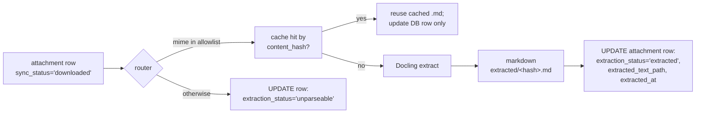
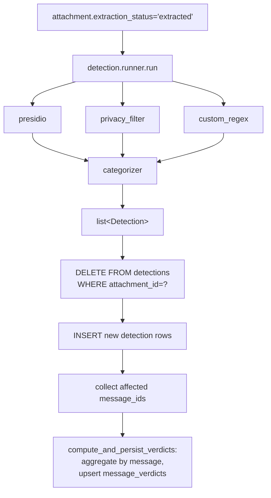

# Scan pipeline (phase 2)

Phase 2: extract text from cached attachments and run PII detection
over the text. Entry point:
[`inbox_scanner/pipelines/scan_pipeline.py::run_scan`](../inbox_scanner/pipelines/scan_pipeline.py).

Two stages, each independently runnable:

- **Stage A — Extract.** Reads downloaded blobs, runs Docling, writes
  cached markdown.
- **Stage B — Detect.** Reads cached markdown, runs three detectors,
  writes `detections` and `message_verdicts`.

Skipped via `--only-extract` or `--only-detect`. Both run by default.

## Stage A — extraction

Entry: `_select_extract_work` → `_process_one` per attachment.



### Router

[`extraction/router.py`](../inbox_scanner/extraction/router.py).
Mime-only allowlist; no content sniffing. PDF text-layer detection
that v1 used to do is gone — Docling 2.x's PDF pipeline has
`do_ocr=True` by default and falls back to OCR automatically when a
PDF has no text layer. See
[ADR 0003](decisions/0003-single-extraction-backend.md).

```python
DOCLING_MIME_TYPES = {
    # Documents
    "application/pdf",
    "application/vnd.openxmlformats-officedocument.wordprocessingml.document",
    "application/vnd.openxmlformats-officedocument.spreadsheetml.sheet",
    "application/vnd.openxmlformats-officedocument.presentationml.presentation",
    "application/msword",
    "text/html", "text/plain", "text/csv", "text/markdown",
    # Images — Docling routes these through its IMAGE pipeline (OCR)
    "image/png", "image/jpeg", "image/tiff", "image/bmp", "image/webp",
}

def route(mime_type) -> Literal["docling", "unparseable"]:
    return "docling" if _canonicalize(mime_type) in DOCLING_MIME_TYPES else "unparseable"
```

Aliases canonicalized: `image/jpg` → `image/jpeg`, `image/x-png` →
`image/png`. Anything outside the allowlist (HEIC, SVG, GIF, archives,
audio/video) gets `extraction_status='unparseable'` with a
human-readable reason.

### Docling extractor

[`extraction/docling_extractor.py`](../inbox_scanner/extraction/docling_extractor.py).

```python
from docling.document_converter import DocumentConverter
from docling.datamodel.base_models import DocumentStream

converter = DocumentConverter()  # singleton; ~2 GB models lazy-downloaded on first call

def extract(content: bytes, filename: str) -> str:
    stream = DocumentStream(name=filename, stream=BytesIO(content))
    result = converter.convert(stream)
    return result.document.export_to_markdown()
```

Default settings (`PdfPipelineOptions(do_ocr=True, do_table_structure=True,
ocr_options=OcrAutoOptions())`) handle every category we care about.
`export_to_markdown()` preserves table structure — receipts and forms
come out as proper markdown tables.

**OCR backend selection.** `OcrAutoOptions` picks the first available
of: Apple Vision (`ocrmac`, macOS), EasyOCR (`easyocr`, needs `cv2`),
RapidOCR (ONNX fallback). We depend on `opencv-python-headless`
explicitly because the GUI-flavored `opencv-python` wheel fails to
load on headless macOS — see CLAUDE.md gotchas.

**First-run download.** Docling lazy-loads its layout/table/OCR models
under `~/.cache/huggingface/hub/` (~2 GB combined). We log
`docling.first_call_may_download_models` once per process.

### Cache by `content_hash`

Two attachments with identical bytes share one extraction. The cache
key is the blob's SHA-256 hash; the cached markdown lives at
`<data_dir>/extracted/<content_hash>.md`.

`_process_one` does the lookup before invoking Docling:

```python
cached = _read_cached_extraction(settings.extracted_dir, content_hash)
if cached is not None:
    _record_extraction(..., status='extracted', extracted_text_path=cached)
    return EXT_EXTRACTED  # no Docling call
```

In practice this saves significant wall time on inboxes where the same
attachment (insurance card, form template, marketing asset) shows up
across multiple messages.

### Concurrency

```python
sem = asyncio.Semaphore(extract_concurrency)  # default 2
await asyncio.gather(*[do_one(item) for item in work])
```

Docling does its own internal threading for layout/table/OCR; the
outer semaphore keeps the rich progress bar honest and bounds the
worst-case Python-side memory by limiting active extractions.

## Stage B — detection

Entry: `_select_detect_work` → `_run_detection_for_attachment` →
`_persist_detections` → `_compute_and_persist_verdicts`.



### The three detectors

[`detection/runner.py::run`](../inbox_scanner/detection/runner.py)
calls all three sequentially per text input. Each returns `Finding`
dataclasses; the categorizer maps them to `Detection`s.

#### Presidio

[`presidio_detector.py`](../inbox_scanner/detection/presidio_detector.py).
Pinned to nine entity types per the plan:

```
CREDIT_CARD, IBAN_CODE, US_SSN, US_PASSPORT, US_DRIVER_LICENSE,
US_BANK_NUMBER, US_ITIN, EMAIL_ADDRESS, PHONE_NUMBER
```

Why explicit allowlist: Presidio's stock recognizers include generic
`PERSON`, `LOCATION`, `ORG` from spaCy NER. We get better
contextual-entity detection from Privacy Filter (below) and skip those
to keep the noise floor low.

- NLP engine: spaCy `en_core_web_sm` (~12 MB). The default
  `en_core_web_lg` (580 MB) buys nothing for the pattern-based
  recognizers we actually use.
- Confidence threshold: configurable, default 0.5.
- Logger `presidio-analyzer` is lifted to ERROR at first engine load
  to suppress the per-call `"Entity MONEY is not mapped"` warnings
  that fire because we don't allowlist MONEY.

#### Privacy Filter (`openai/privacy-filter`)

[`privacy_filter_detector.py`](../inbox_scanner/detection/privacy_filter_detector.py).
HuggingFace token-classification pipeline. Detects:

```
account_number, private_address, private_email, private_person,
private_phone, private_url, private_date, secret
```

- `aggregation_strategy="simple"` collapses BIE-tagged token runs into
  spans.
- 4000-char chunks with 200-char overlap so long markdown files still
  fit comfortably; spans are re-based to the original text offsets
  before being returned.
- 2.6 GB model under `~/.cache/huggingface/hub/`. ~50 s first load;
  subsequent loads use the cached model (~1 s).
- Confidence threshold: configurable, default 0.6.

**BIE→S merging.** The "simple" strategy doesn't merge a BIE-sequence
into an adjacent `S-`-tagged single-token span — so a name like
`Santosh Vemu` whose tokenizer split is 2+1 subwords used to come out
as two findings (`"Sa…V"` then `"emu"`). We post-process via
`_merge_adjacent_same_subtype`: walk sorted findings, merge
consecutive same-detector + same-subtype findings with `≤ 1` char gap,
length-weighted mean confidence. The aggregate finding count on the
dev corpus dropped from 118 → 61 with this fix.

#### Custom regex (US-specific)

[`custom_regex.py`](../inbox_scanner/detection/custom_regex.py). Two
patterns — each provides signal neither Presidio nor Privacy Filter
can:

| subtype | example match | fixed confidence | category | why kept |
|---|---|---|---|---|
| `tax_form` | `W-2`, `1099-NEC`, `Form 8889`, `Schedule C` | 0.85 | `tax` | Document-type detector. Catches blank/template tax forms that contain no fillable PII for the models to find (the dev-corpus HSA Withdrawal Form was caught only by this) |
| `mnemonic_phrase` | 12 or 24 lowercase BIP-39-shaped words | 0.95 | `credentials` | Crypto wallet seed phrases look like ordinary English wordlists; the model's `secret` label doesn't generalise to them. Catastrophic loss class with very low FPR thanks to the count-and-shape constraint |

Earlier iterations also shipped `medical_record_number`,
`insurance_id`, `medical_keyword`, `credential_kv`, `recovery_code`,
and `legal_keyword`. Those were dropped in the v1 simplification —
either they duplicated Privacy Filter's `secret` / `account_number`
labels at lower precision, or they were bare keyword spotters too
imprecise to be actionable. See custom_regex.py's module docstring
for the full history. Two consequences:

- The `medical` and `legal` user categories currently have no v1
  feeders. They remain in `RISK_WEIGHTS` and `FLAGGABLE_CATEGORIES`
  so a future detector can repopulate them without a categorizer
  change.
- Existing scan rows with the removed subtypes get cleared on the
  next `scan` run (detection is rewritten per-scan).

### Categorizer

[`categorizer.py`](../inbox_scanner/detection/categorizer.py). Single
source of truth for `(detector, subtype) → user_category`:

| Detector + subtype | User category |
|---|---|
| `presidio` US_SSN / US_PASSPORT / US_DRIVER_LICENSE / US_ITIN | `gov_id` |
| `presidio` CREDIT_CARD / IBAN_CODE / US_BANK_NUMBER | `financial` |
| `presidio` EMAIL_ADDRESS / PHONE_NUMBER | `other_pii` |
| `privacy_filter` account_number | `financial` |
| `privacy_filter` secret | `credentials` |
| `privacy_filter` private_* (address, email, person, phone, url, date) | `other_pii` |
| `custom_regex` tax_form | `tax` |
| `custom_regex` mnemonic_phrase | `credentials` |

A coverage test (`tests/test_categorizer.py::test_every_mapped_category_is_known`)
asserts every category in this map has a weight in `RISK_WEIGHTS`.
Adding a new subtype is one row here plus the detector's emit.

### Verdict computation

`compute_verdict(detections) -> {is_flagged, top_category, risk_score, category_summary}`:

- **`is_flagged`** is true iff at least one detection belongs to a
  flaggable category. The six flaggable categories are everything
  except `other_pii`:
  `gov_id, credentials, financial, medical, tax, legal`.
  A message with only `other_pii` findings (names/addresses/emails
  alone) is informational, not flagged.
- **`risk_score = sum(RISK_WEIGHTS[cat] × count_per_cat)`, capped at
  100.** Weights:
  ```
  gov_id      = 10
  credentials = 10
  financial   = 7
  medical     = 7
  tax         = 5
  legal       = 3
  other_pii   = 0
  ```
- **`top_category`** picks the highest-weight category present (ties
  broken by detection count, then alphabetical for determinism). When
  only `other_pii` findings exist it falls back to that for UI
  display, even though `is_flagged=False`.
- **`category_summary`** is `{category: count}` — what the UI's
  badges render.

### Per-scan rewrite

For each attachment that produced findings this run:

```sql
BEGIN;
DELETE FROM detections WHERE attachment_id = ?;
INSERT INTO detections (...) VALUES (...);
COMMIT;
```

Then per affected `message_id`:

```sql
BEGIN;
-- Aggregate over ALL of this message's detections (across attachments)
SELECT category, subtype, detector, span_text, span_start, span_end, confidence
  FROM detections d
  JOIN attachments a ON a.id = d.attachment_id
  WHERE a.message_id = ?;
-- Compute verdict ...
DELETE FROM message_verdicts WHERE message_id = ?;
INSERT INTO message_verdicts (...) VALUES (...);
COMMIT;
```

Two consequences:

1. **Re-running scan is bit-for-bit idempotent.** Modulo `scan_id`
   and timestamps, the tuple set of detections + verdicts is the same
   across two consecutive scans.
2. **Detector tuning is safe.** Lower a threshold, re-scan, get more
   findings. The old findings are gone — never co-mingled with the
   new ones.

### Concurrency

Detection sequentializes per attachment (`detect_concurrency=1` by
default). The bottleneck is Privacy Filter inference, which already
batches internally; running it 2× in parallel on CPU just thrashes the
process. The knob exists for future tuning if we ever ship GPU
inference.

## Logging quirks

The detect stage exercises three third-party loggers that are noisy by
default. We silence them at first-use inside the detector singletons
so the rich progress bar isn't fighting per-call WARNINGs:

- `presidio-analyzer` — emits `"Entity MONEY is not mapped..."` per
  document. Lifted to ERROR in `_get_engine()`.
- `transformers` — emits the `Loading weights: 0…100%` tqdm bar on
  first model load. Disabled via `hf_logging.disable_progress_bar()`
  and verbosity raised to ERROR.
- `huggingface_hub` — emits `"You are sending unauthenticated
  requests..."` on every cache check. Lifted to ERROR and the
  matching `warnings.filterwarnings('ignore', ...)` rule installed.

All three live in `_get_pipeline()` / `_get_engine()` so they only
fire once.

## What "good" looks like on the dev corpus

Reference numbers from the 37-attachment dev corpus (your real inbox,
mostly receipts + USPS Informed Delivery + a shipping label):

| Stage | Time | Output |
|---|---|---|
| Extract (cold, model downloads included) | ~3 min | 37 attachments → 36 unique `.md` files (1 dedup hit), ~24 KB markdown |
| Extract (cached) | < 1 s | 0 work; all hashes hit the cache |
| Detect (cold, models load) | ~3 min | 74 detections, 18 message verdicts, 9 flagged |
| Detect (warm) | ~80 s | same |
| Re-detect (warm, no flags change) | ~80 s | byte-identical tuple set |

Detection time is dominated by Privacy Filter inference (~2 s per
document on CPU). Presidio + regex contribute a few hundred ms total.

## See also

- [Data model](data-model.md#re-scan-semantics) — what re-scan
  rewrites in the DB.
- [ADR 0003](decisions/0003-single-extraction-backend.md) — why
  Docling-only.
- [ADR 0005](decisions/0005-three-detector-pipeline.md) — why three
  detectors rather than one model.
