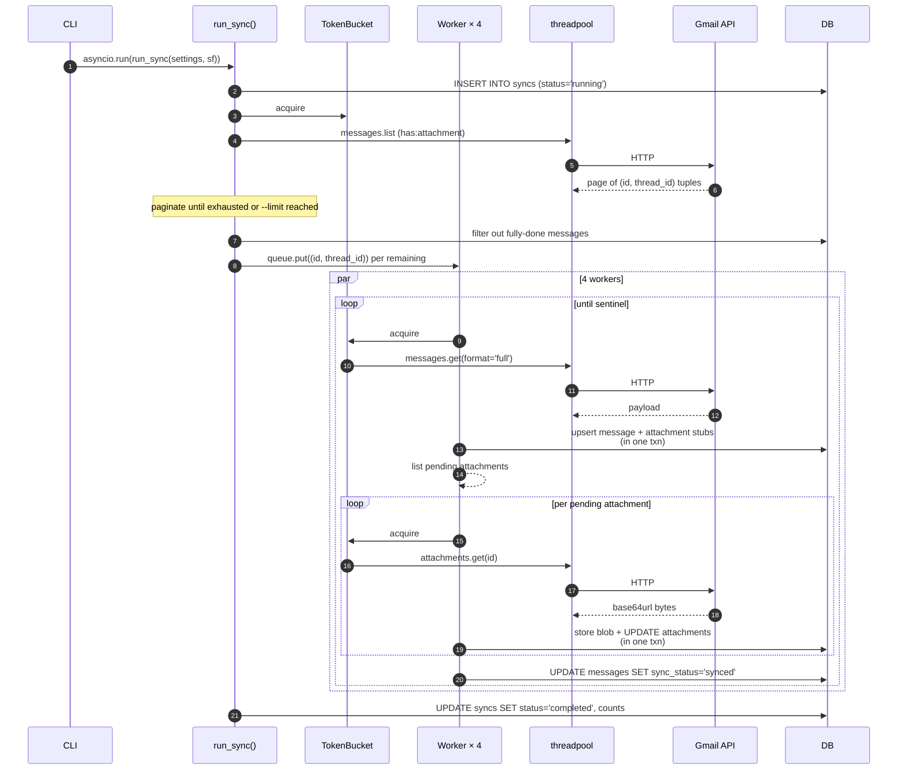

# Sync pipeline (phase 1)

Phase 1: download Gmail message metadata + attachment bytes into the
local store. Entry point:
[`inbox_scanner/gmail/sync.py::run_sync`](../inbox_scanner/gmail/sync.py).

## Goals

- **Idempotent on re-run.** Resync against the same DB never duplicates
  rows, never re-pulls work that's already done.
- **Resumable.** Ctrl-C mid-flight leaves the DB in a state where the
  next `inbox-scanner sync` continues from where it stopped.
- **Bounded resource use.** Rate-limited so we don't trip Gmail's
  quota; disk usage capped per-attachment.

## Flow



## Stages within one sync run

### 1. List candidate messages

Calls `users.messages.list(userId='me', q='has:attachment')` with
optional `after:YYYY/MM/DD` filter when `--since` is passed. Paginates
through `nextPageToken` until exhausted or `--limit` is reached.

Output: a flat `[(message_id, thread_id), ...]` list.

Per the Gmail API docs, this returns ~30% noise — messages whose only
"attachment" is an inline tracking pixel or meeting invite. The
metadata fetch in stage 2 walks MIME parts; the skip filters in stage
3 throw those away.

### 2. Filter to messages that need work

```python
def _filter_needs_work(session_factory, candidate_ids):
    # Returns only messages that aren't fully synced.
    # Full done = message.sync_status='synced' AND no attachment is still 'pending'.
```

A message is **fully done** when:

1. Its `messages` row has `sync_status='synced'`, AND
2. No row in `attachments` for this `message_id` has
   `sync_status='pending'`.

Anything else (no row yet, `sync_status='pending'`, `sync_error`, or
synced-but-some-attachment-still-pending) goes into the work queue.
This is what makes re-runs cheap on large inboxes: a 50,000-message
inbox where everything's already synced finishes the listing in
seconds and the work-set filter in milliseconds.

### 3. Per-message processing (worker body)

Each of 4 workers pulls from an `asyncio.Queue(maxsize ≥ 50)`. For
each message:

#### 3a. Fetch full message

```python
client.get_message(message_id)  # format='full'
```

`format='full'` is the only format that returns the `parts` tree we
need. `format='metadata'` was attempted in step 2 of the build but
turned out to strip parts — see [the build's first bug
fix](../docs/IMPLEMENTATION_PLAN.md) for context. Costs 5 quota units
per call.

#### 3b. Walk the MIME tree and apply skip filters

`walk_attachment_parts(payload)` does a recursive descent yielding
only leaf parts with a non-empty `filename` and a `body.attachmentId`.
Each yielded part has:

- `partId` — the stable identifier (Gmail docs: "the immutable ID of
  the message part")
- `mimeType`, `filename`, `body.size`, `body.attachmentId`

The `_classify_attachment(mime, size, max_bytes)` classifier emits one
of these statuses up-front, before any download:

| Condition | `sync_status` |
|---|---|
| `mime` in `{image/gif, text/calendar, application/pkcs7-signature, application/pgp-signature}` | `skipped_filter` |
| `size_bytes < 1024` | `skipped_filter` |
| `size_bytes > settings.extraction.max_attachment_bytes` (default 50 MB) | `skipped_too_large` |
| otherwise | `pending` |

The skip-filter set comes from the implementation plan. Tracking
pixels and calendar invites are the dominant noise sources in real
inboxes.

#### 3c. Persist message + attachment stubs (one transaction)

`_persist_message_stub` runs **inside** `asyncio.to_thread` and uses
[`session_scope`](../inbox_scanner/db.py) for transactional
boundaries. It:

1. Upserts the `messages` row.
2. For each attachment part:
   - Builds the composite primary key
     `make_composite_attachment_id(message_id, part_id)`.
   - If a row already exists at that key, **refreshes**
     `gmail_attachment_id` (it expires after a few hours — see
     [ADR 0004](decisions/0004-attachment-key-uses-part-id.md)) and
     leaves the rest alone.
   - Otherwise inserts a new row with the classified `sync_status`.
3. Returns `[(composite_id, gmail_attachment_id), ...]` for the
   attachments that still need bytes downloaded.

The fresh `gmail_attachment_id` flows through to the download step
below — we never persist-then-fetch with stale ids.

#### 3d. Download attachment bytes

For each pending attachment id:

```python
content = client.download_attachment(message_id, gmail_attachment_id)
# Gmail returns URL-safe base64; download_attachment() decodes.
```

Then `store_blob(content, attachments_dir)`:

1. `digest = sha256(content).hexdigest()`
2. `rel_path = blobs/{digest[:2]}/{digest[2:4]}/{digest}`
3. If `<attachments_dir>/<rel_path>` already exists, return early
   (content-addressed dedup — two messages with the same attachment
   share one blob).
4. Otherwise write to a `.tmp` sibling and `os.rename` over the final
   path (atomic on POSIX).

Then UPDATE the attachment row: set `content_hash`, `blob_path`,
`sync_status='downloaded'`, `downloaded_at=now()`.

#### 3e. Mark message synced

Once all pending attachments are downloaded (or terminally errored),
the message row's `sync_status` flips to `synced`. `synced_at` is set.

### 4. Finalize the sync row

`status='completed'`, totals filled in. On unhandled exception:
`status='failed'`, `error` populated. The error path uses
`asyncio.to_thread` to write to DB even from inside an `except` block.

## Concurrency knobs

Defined in
[`gmail/sync.py`](../inbox_scanner/gmail/sync.py) and
[`gmail/rate_limiter.py`](../inbox_scanner/gmail/rate_limiter.py).

| Knob | Default | Where | Why |
|---|---|---|---|
| Concurrent workers | 4 | `concurrency` param to `run_sync` | Plan §"Concurrency"; matches Google's recommended per-user parallelism for the Gmail API |
| Token-bucket rate | 20 req/sec | `rate_rps` param | Gmail's per-user quota is ~250 units/sec; `messages.get` + `attachments.get` are 5 units each, so 20 RPS × 5 = 100 units/sec — well under |
| Bucket capacity | = rate | `TokenBucket.__init__` | Allows a 1-second burst from cold; steady-state stays bounded |
| Retry attempts | 5 | `_gmail_call_with_retry(max_attempts=5)` | Exponential backoff (2^n + jitter) on `{429, 500, 502, 503, 504}`; other statuses re-raise immediately |

The token bucket is the single source of throttling. Workers don't
self-rate-limit; they all draw from the same bucket. The bucket is an
`asyncio.Lock`-guarded refill loop, not the classic
`time.sleep`-blocking pattern, so workers free the event loop while
waiting.

## Resume semantics

Three failure modes, three behaviors:

| What happened | DB state after crash | Behavior on next `sync` |
|---|---|---|
| Ctrl-C between messages | last in-flight message left at `sync_status='pending'`; attachments may be mixed states | next run picks up where it left off; partially-downloaded message is fully re-processed (idempotent due to blob dedup) |
| Gmail returned 5xx after retries exhausted | `sync_status='sync_error'`, `sync_error` populated | next run retries it (the filter selects `pending OR sync_error`) |
| Worker exception (parsing, DB) | same as above | same — retried next run |

Blob storage is the linchpin: because filenames are content hashes, a
re-download of the same bytes lands on the same on-disk file and is a
no-op. The DB updates around it are idempotent UPDATE-by-PK
statements.

## Throughput in practice

On the dev corpus (a personal Gmail with 20 most-recent messages with
attachments, fully cached):

- `sync --limit 20` cold (nothing in DB): ~3 seconds with 4 workers
  and 20 RPS bucket.
- Re-running `sync --limit 20`: ~1 second (no work, just the listing
  and filter pass).

For a 5,000-message inbox a cold sync is roughly 5 minutes; 50,000 is
roughly an hour. Bandwidth dominates: large attachments
(`pdf`, `jpg` scans) usually mean a full sync transfers many GB.

## What's *not* in scope here

- The sync pipeline never reads the extracted markdown or runs
  detectors. Once messages and attachments are marked synced, every
  re-run of `inbox-scanner scan` operates entirely on local files.
- It also doesn't watch for new mail. Each `inbox-scanner sync` is a
  one-shot historical sweep; a daemon mode is in the v2 backlog.

## See also

- [Scan pipeline](scan-pipeline.md) — phase 2 deep dive.
- [Architecture § concurrency model](architecture.md#concurrency-model)
  — sequence diagram for the whole sync run.
- [ADR 0002](decisions/0002-content-addressed-blob-storage.md) — blob
  storage choice.
- [ADR 0004](decisions/0004-attachment-key-uses-part-id.md) — why
  `part_id`, not `gmail_attachment_id`, is in the PK.
